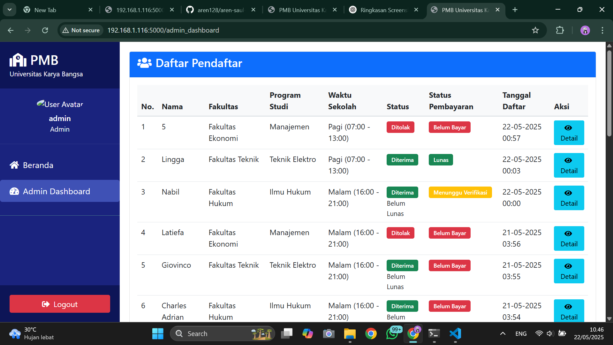
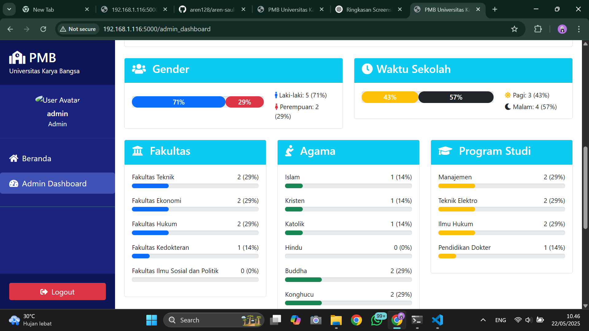
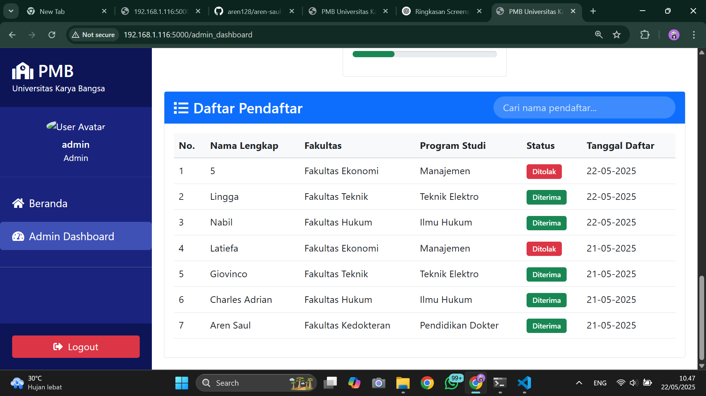
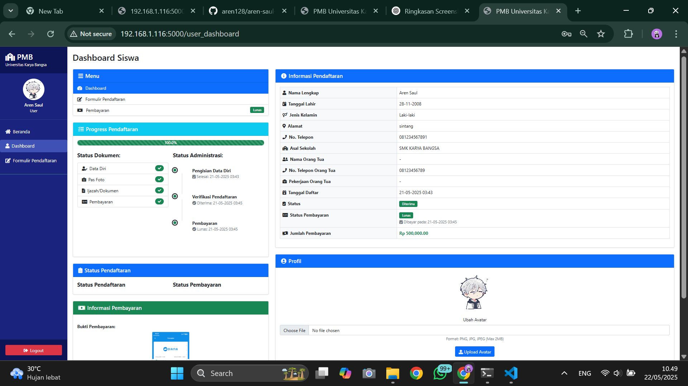
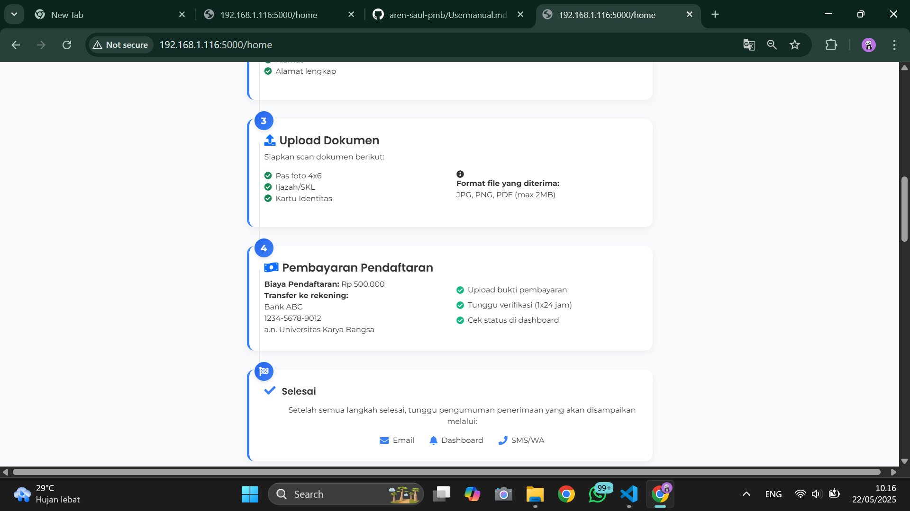
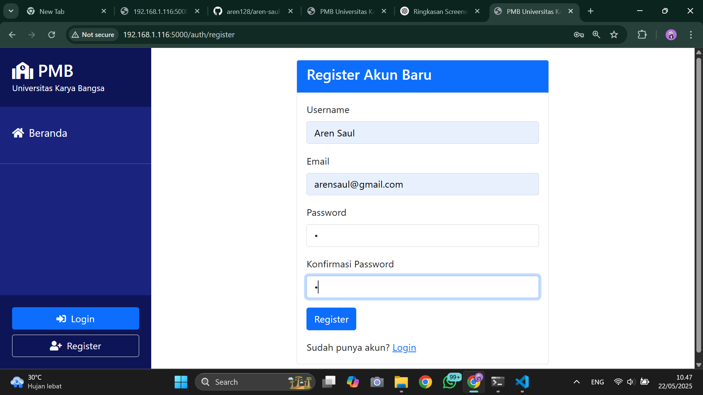
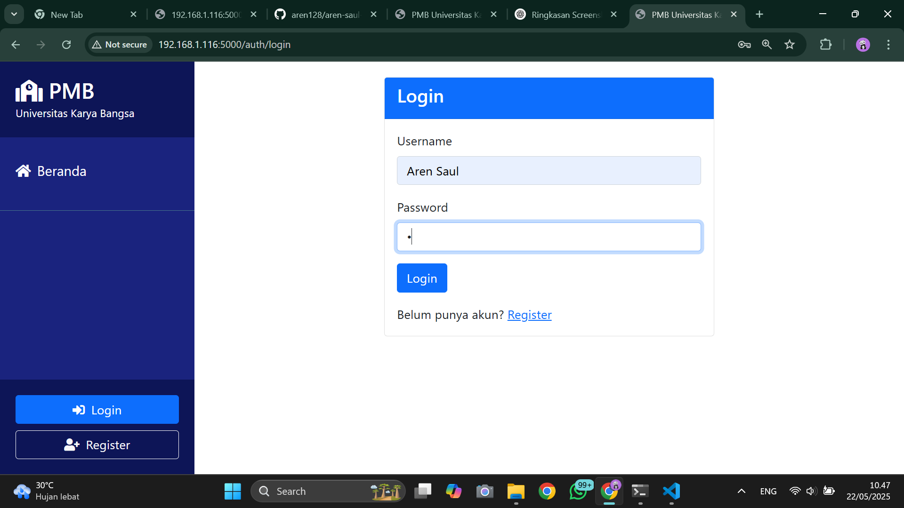
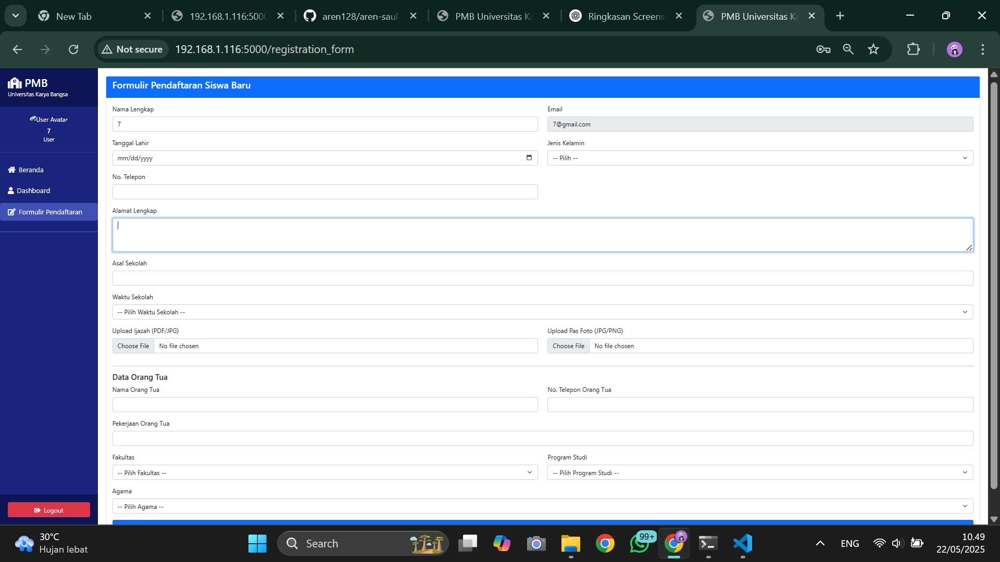
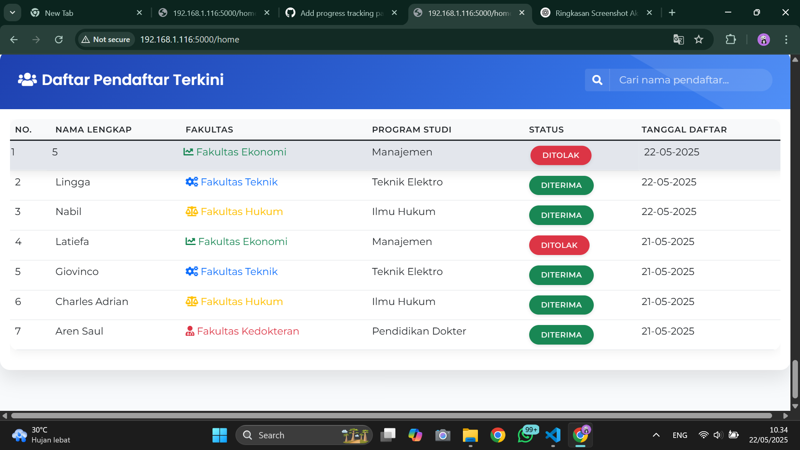
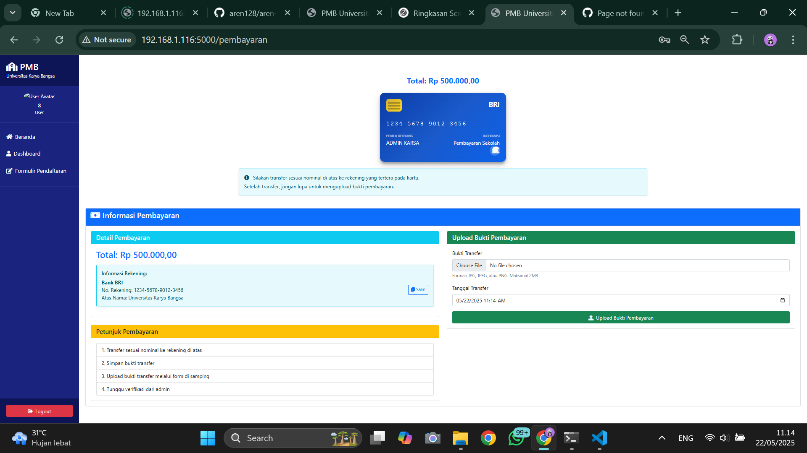

# 🎓 Sistem Penerimaan Mahasiswa Baru (PMB)


## 👨‍💻 Developer
**Aren Saul**
- Email: arensaul51@gmail.com
- GitHub: [github.com/arensaul](https://github.com/aren128)

## 📸 Screenshot Aplikasi

### 🏠 Halaman Utama
<div align="center">
  
  <p>Tampilan halaman utama sistem PMB</p>
</div>

### 📊 Statistik Pendaftaran
<div align="center">
  <!-- Overview -->
  
  
  <!-- Statistics Grid -->
  <div style="margin-bottom: 20px;">
    
    
  </div>
  <div style="margin-bottom: 20px;">
    
    
  </div>
  <p>Dashboard statistik pendaftaran realtime</p>
</div>

### 🎓 Program Studi
<div align="center">
  
  <p>Daftar lengkap program studi yang tersedia</p>
</div>

### 📝 Alur Pendaftaran
<div align="center">
  <!-- Registration Steps Row 1 -->
  <div style="margin-bottom: 20px;">
    
    
  </div>
  
  <!-- Registration Steps Row 2 -->
  <div style="margin-bottom: 20px;">
    
    
    
  </div>
  <p>Langkah-langkah pendaftaran mahasiswa baru</p>
</div>

### 👥 Daftar Pendaftar
<div align="center">
  
  <p>Tabel daftar calon mahasiswa yang sudah mendaftar</p>
</div>

### 💳 Pembayaran
<div align="center">
  
  <p>Sistem pembayaran dan verifikasi pendaftaran</p>
</div>

## ✨ Fitur Utama
- 🔐 **Autentikasi Multi-User**
  - Login mahasiswa & admin
  - Manajemen sesi
  - Reset password
- 📝 **Pendaftaran Online**
  - Form wizard
  - Validasi data
  - Auto-save progress
- 📎 **Manajemen Dokumen**
  - Upload multi-file
  - Preview dokumen
  - Verifikasi otomatis
- 💳 **Sistem Pembayaran**
  - Multiple channel
  - Verifikasi otomatis
  - Notifikasi status
- 📊 **Dashboard Admin**
  - Statistik realtime
  - Monitoring pendaftar
  - Laporan pendaftaran
- 📱 **Progress Tracking Realtime**
  - Status pendaftaran
  - Notifikasi
  - Progres verifikasi
- 📨 **Sistem Notifikasi Terintegrasi**
  - Email
  - SMS
  - Notifikasi dalam aplikasi
- 👤 **Manajemen Profil & Avatar**
  - Update data diri
  - Ganti password
  - Upload foto profil
- 📊 **Visualisasi Data & Statistik**
  - Grafik interaktif
  - Export data
  - Filter dan drill-down data

## 🛠 Tech Stack
- **Backend:** Python Flask
- **Database:** SQLAlchemy dengan SQLite/MySQL
- **Frontend:** Bootstrap 5, HTML5, CSS3
- **JavaScript Libraries:** 
  - Font Awesome 5
  - Chart.js (visualisasi data)
  - jQuery
- **Keamanan:** 
  - Flask-Login
  - Werkzeug Security
  - Safe file upload handling

## 🚀 Instalasi

### Prasyarat
- Python 3.8+
- pip (Python package manager)
- Git

### Langkah Instalasi

1. Clone repository
```bash
git clone https://github.com/yourusername/pmb-system.git
cd pmb-system
```

2. Buat virtual environment
```bash
python -m venv venv
# Windows
venv\Scripts\activate
# Linux/Mac
source venv/bin/activate
```

3. Install dependencies
```bash
pip install -r requirements.txt
```

4. Konfigurasi environment
```bash
# Buat file .env
FLASK_APP=run.py
FLASK_ENV=development
SECRET_KEY=your-secret-key
DATABASE_URL=sqlite:///pmb.db
```

5. Inisialisasi database
```bash
flask db init
flask db migrate
flask db upgrade
```

6. Buat direktori upload
```bash
mkdir -p static/uploads/payment_proofs
mkdir -p static/images/avatars
```

7. Jalankan aplikasi
```bash
python run.py
```

## 📱 Panduan Pengguna

### Calon Mahasiswa
1. **Registrasi & Login**
   - Daftar akun baru
   - Login ke sistem
   - Kelola profil dan avatar

2. **Pengisian Formulir**
   - Data pribadi
   - Data akademik
   - Informasi orang tua
   - Pilihan fakultas & jurusan

3. **Upload Dokumen**
   - Pas foto 4x6
   - Scan ijazah/SKL
   - Dokumen pendukung

4. **Pembayaran**
   - Lihat instruksi pembayaran
   - Upload bukti transfer
   - Pantau status verifikasi

5. **Progress Tracking**
   - Cek status pendaftaran
   - Lihat notifikasi
   - Pantau progres verifikasi

### Admin
1. **Dashboard**
   - Statistik pendaftaran
   - Grafik distribusi fakultas
   - Monitoring pembayaran

2. **Manajemen Pendaftar**
   - Lihat detail pendaftar
   - Verifikasi dokumen
   - Update status pendaftaran

3. **Verifikasi Pembayaran**
   - Cek bukti pembayaran
   - Konfirmasi pembayaran
   - Kirim notifikasi

## 📁 Struktur Proyek
```
pmb/
├── auth/                     # Autentikasi
│   ├── __init__.py
│   └── routes.py
├── static/                   # Aset statis
│   ├── css/
│   │   └── style.css
│   ├── js/
│   │   └── main.js
│   ├── uploads/
│   │   └── payment_proofs/
│   └── images/
│       └── avatars/
├── templates/                # Template HTML
│   ├── auth/
│   │   ├── login.html
│   │   └── register.html
│   ├── admin_dashboard.html
│   ├── dashboard.html
│   ├── layout.html
│   ├── pembayaran.html
│   └── registration_form.html
├── models.py                # Model database
├── run.py                   # Entry point
└── requirements.txt         # Dependencies
```

## 💡 Fitur Mendatang
- [ ] Integrasi payment gateway
- [ ] Sistem ujian online
- [ ] Export data ke Excel/PDF
- [ ] API untuk integrasi eksternal
- [ ] Dashboard analitik lanjutan

## 🤝 Kontribusi
Kontribusi selalu diterima. Untuk perubahan besar, silakan buka issue terlebih dahulu.

## 🙏 Acknowledgments
- Flask Team
- Bootstrap Team
- Font Awesome
- Aren Saul (Developer)
- Seluruh kontributor


