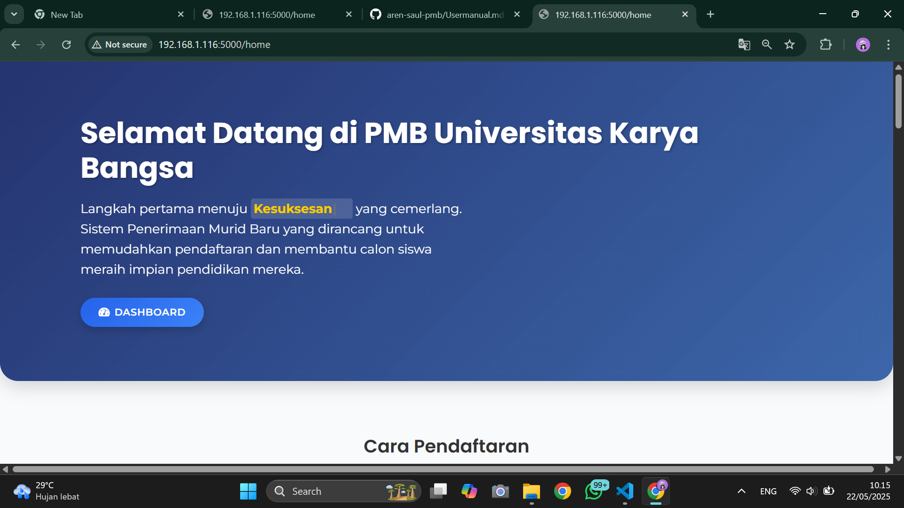
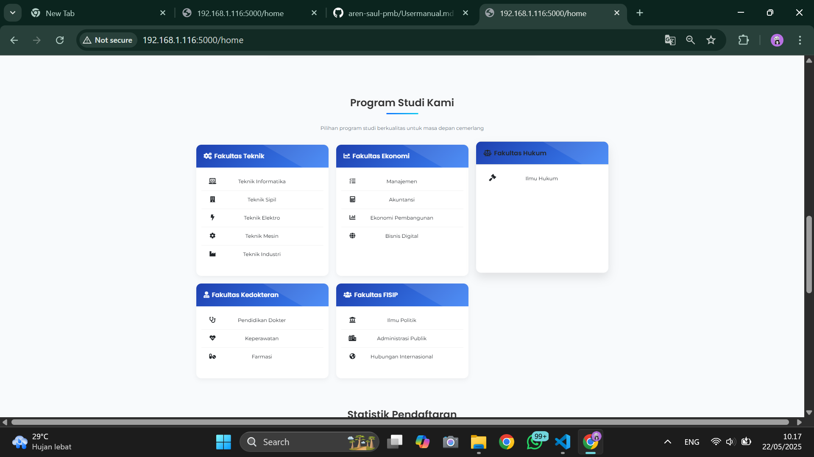
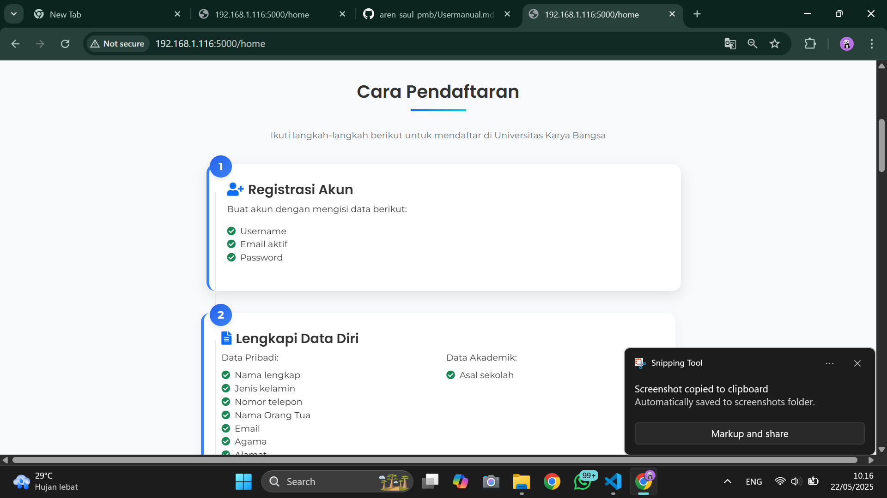
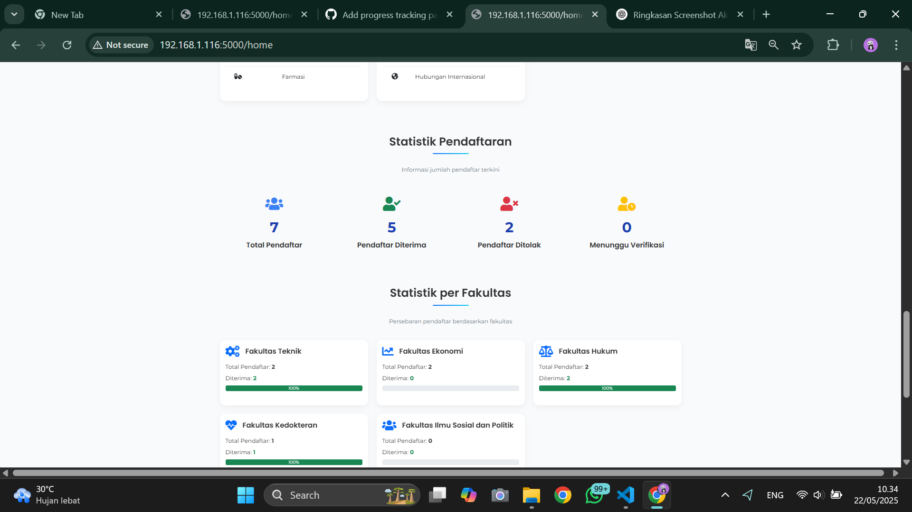

# 🎓 Sistem Penerimaan Mahasiswa Baru (PMB)

## 📸 Screenshot Aplikasi

### Halaman Utama



<p align="center">Tampilan halaman utama sistem PMB</p>

### Statistik Pendaftaran

<p align="center">Dashboard statistik pendaftaran</p>

### Program Studi

<p align="center">Daftar program studi yang tersedia</p>

### Alur Pendaftaran

(static/images/screenshots/landing2.png)
<p align="center">Langkah-langkah pendaftaran mahasiswa baru</p>

### Daftar Pendaftar

(static/images/screenshots/landing7.png)
<p align="center">Tabel daftar calon mahasiswa yang sudah mendaftar</p>

## 📋 Overview
Sistem informasi penerimaan mahasiswa baru berbasis web menggunakan Flask. Sistem ini menyediakan manajemen lengkap untuk proses pendaftaran mahasiswa baru, dari registrasi hingga pembayaran dan verifikasi.

## ✨ Fitur Utama
- 🔐 Autentikasi Multi-User (Mahasiswa & Admin)
- 📝 Formulir Pendaftaran Online
- 📎 Upload & Verifikasi Dokumen
  - Pas foto 4x6
  - Ijazah/SKL
  - Kartu identitas
- 💳 Sistem Pembayaran & Verifikasi
- 📊 Dashboard Admin & Statistik
- 📱 Progress Tracking Realtime
- 📨 Sistem Notifikasi Terintegrasi
- 👤 Manajemen Profil & Avatar
- 📊 Visualisasi Data & Statistik

## 🛠 Tech Stack
- **Backend:** Python Flask
- **Database:** SQLAlchemy dengan SQLite/MySQL
- **Frontend:** Bootstrap 5, HTML5, CSS3
- **JavaScript Libraries:** 
  - Font Awesome 5
  - Chart.js (visualisasi data)
  - jQuery
- **Keamanan:** 
  - Flask-Login
  - Werkzeug Security
  - Safe file upload handling

## 🚀 Instalasi

### Prasyarat
- Python 3.8+
- pip (Python package manager)
- Git

### Langkah Instalasi

1. Clone repository
```bash
git clone https://github.com/yourusername/pmb-system.git
cd pmb-system
```

2. Buat virtual environment
```bash
python -m venv venv
# Windows
venv\Scripts\activate
# Linux/Mac
source venv/bin/activate
```

3. Install dependencies
```bash
pip install -r requirements.txt
```

4. Konfigurasi environment
```bash
# Buat file .env
FLASK_APP=run.py
FLASK_ENV=development
SECRET_KEY=your-secret-key
DATABASE_URL=sqlite:///pmb.db
```

5. Inisialisasi database
```bash
flask db init
flask db migrate
flask db upgrade
```

6. Buat direktori upload
```bash
mkdir -p static/uploads/payment_proofs
mkdir -p static/images/avatars
```

7. Jalankan aplikasi
```bash
python run.py
```

## 📱 Panduan Pengguna

### Calon Mahasiswa
1. **Registrasi & Login**
   - Daftar akun baru
   - Login ke sistem
   - Kelola profil dan avatar

2. **Pengisian Formulir**
   - Data pribadi
   - Data akademik
   - Informasi orang tua
   - Pilihan fakultas & jurusan

3. **Upload Dokumen**
   - Pas foto 4x6
   - Scan ijazah/SKL
   - Dokumen pendukung

4. **Pembayaran**
   - Lihat instruksi pembayaran
   - Upload bukti transfer
   - Pantau status verifikasi

5. **Progress Tracking**
   - Cek status pendaftaran
   - Lihat notifikasi
   - Pantau progres verifikasi

### Admin
1. **Dashboard**
   - Statistik pendaftaran
   - Grafik distribusi fakultas
   - Monitoring pembayaran

2. **Manajemen Pendaftar**
   - Lihat detail pendaftar
   - Verifikasi dokumen
   - Update status pendaftaran

3. **Verifikasi Pembayaran**
   - Cek bukti pembayaran
   - Konfirmasi pembayaran
   - Kirim notifikasi

## 📁 Struktur Proyek
```
pmb/
├── auth/                     # Autentikasi
│   ├── __init__.py
│   └── routes.py
├── static/                   # Aset statis
│   ├── css/
│   │   └── style.css
│   ├── js/
│   │   └── main.js
│   ├── uploads/
│   │   └── payment_proofs/
│   └── images/
│       └── avatars/
├── templates/                # Template HTML
│   ├── auth/
│   │   ├── login.html
│   │   └── register.html
│   ├── admin_dashboard.html
│   ├── dashboard.html
│   ├── layout.html
│   ├── pembayaran.html
│   └── registration_form.html
├── models.py                # Model database
├── run.py                   # Entry point
└── requirements.txt         # Dependencies
```

## 💡 Fitur Mendatang
- [ ] Integrasi payment gateway
- [ ] Sistem ujian online
- [ ] Export data ke Excel/PDF
- [ ] API untuk integrasi eksternal
- [ ] Dashboard analitik lanjutan

## 🤝 Kontribusi
Kontribusi selalu diterima. Untuk perubahan besar, silakan buka issue terlebih dahulu.

## 📝 Lisensi
[MIT](https://choosealicense.com/licenses/mit/)

## 🙏 Acknowledgments
- Flask Team
- Bootstrap Team
- Font Awesome
- Seluruh kontributor
